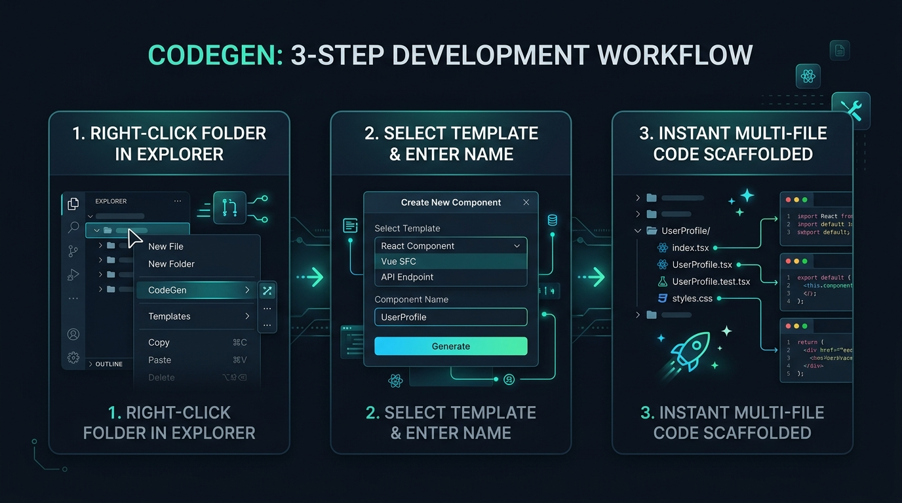
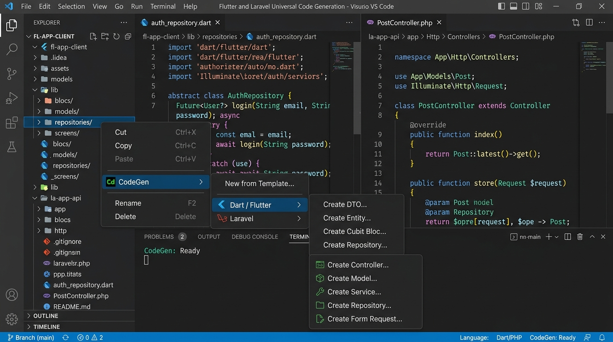
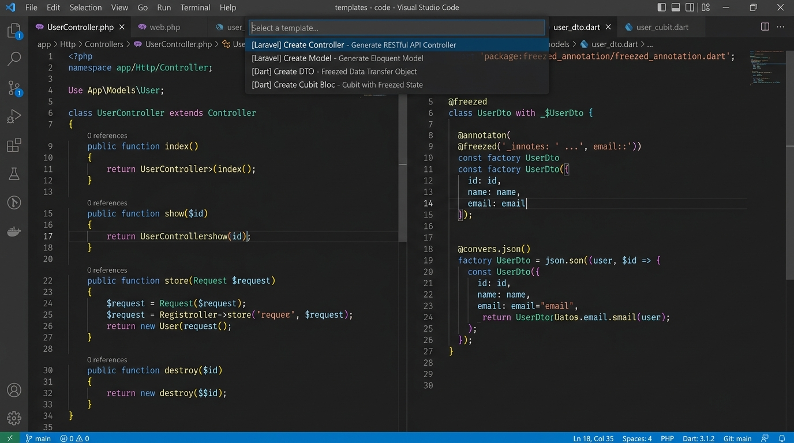
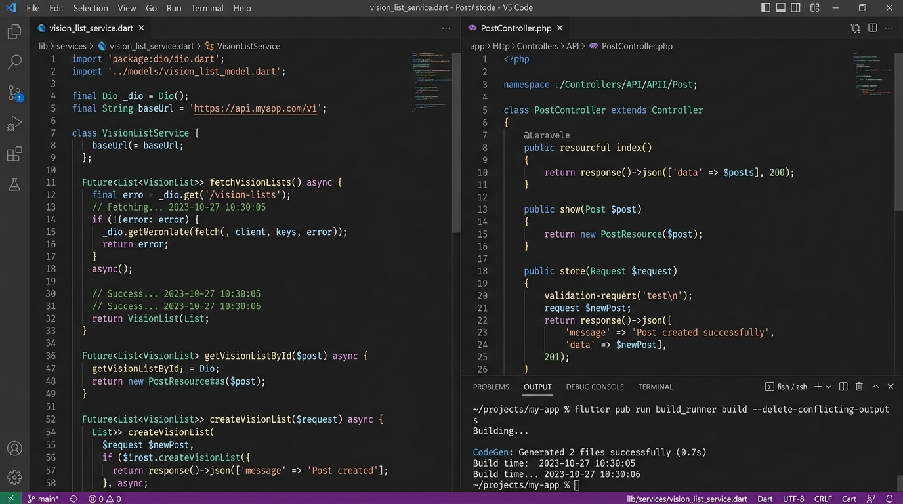

<div align="center">


# CodeGen

**Universal right-click code generator for VS Code & Antigravity IDE.**

[](https://marketplace.visualstudio.com/items?itemName=yusril-rapsanjani.codegen)
[](https://flutter.dev)
[](https://laravel.com)
[](https://react.dev)
[](https://go.dev)
[](https://vuejs.org)
[](https://fastapi.tiangolo.com)
[](LICENSE)
[](https://github.com/yusril/codegen/pulls)

</div>

---

Stop writing repetitive boilerplate by hand.

**CodeGen** is a fast, universal right-click template generator for VS Code and Antigravity IDE. Whether you are building mobile apps with **Flutter / Dart**, backend APIs with **Laravel / PHP**, web frontends with **React** or **Vue**, high-performance microservices with **Go**, or REST APIs with **Python / FastAPI**, CodeGen lets you scaffold production-grade, multi-file code directly inside any selected folder in seconds.

---

## How It Works



1. **Right-click any folder** in your Explorer tree where you want your new files to live.
2. **Select a template** from the context menu (with dedicated submenus for each framework or a searchable universal picker) and enter your component name.
3. **Instant scaffolding**: Complete, typed, production-ready files are generated and opened automatically in your editor.

---

## Visual Showcase

### 1. Explorer Context Menu
Right-click any folder to access the **CodeGen** menu with dedicated submenus for **Flutter**, **Laravel**, **React**, **Go**, **Vue**, **Python**, and a universal picker:



### 2. Searchable Template Picker
Run **New from Template...** (`Ctrl+Shift+P` / `Cmd+Shift+P` or via right-click) to filter and select from all available templates:



### 3. Generated Code Output
Scaffold single or multi-file templates complete with imports, syntax, and formatting:



---

## Features

- **Truly Universal**: Built for multi-language development. Ships with rich presets for Dart/Flutter, Laravel/PHP, React, Go, Vue, and Python/FastAPI, and is easily extensible for any custom stack.
- **1-Click Generation via Explorer**: Right-click folder -> `CodeGen` -> select template. Scaffolding is created directly where you clicked.
- **31+ Built-in Production Presets**: High-quality presets ready to use out of the box across 6 major languages and ecosystems.
- **Global Templates Directory (`~/.codegen/templates`)**: Store your personal scaffolds in one central global directory so they are accessible across all projects on your machine.
- **Multi-File Scaffolding**: Generate companion files (such as Component + CSS Module, Interface + Implementation, or Bloc + State) from a single user prompt.
- **Smart String Case Transformations**: Supports `PascalCase`, `camelCase`, `snake_case`, `kebab-case`, `UPPER_CASE`, and smart plurals (`${NAME_PLURAL_SNAKE_CASE}`, `${NAME_PLURAL_CAMEL_CASE}`, `${NAME_PLURAL_PASCAL_CASE}`).
- **System & Timestamp Metadata**: Automatically injects `${DAY}`, `${MONTH}`, `${YEAR}`, `${HOUR}`, `${MINUTE}`, and `${USER}`.
- **IntelliJ Velocity Compatibility**: Automatically parses legacy IntelliJ and Android Studio Velocity capitalization expressions.
- **Safe Overwrite Protection**: Warns you if target files already exist before overwriting.

---

## Built-in Presets Reference

### Dart / Flutter Presets (10)

| Command | Output File(s) | Description |
| :--- | :--- | :--- |
| **Create DTO** | `${NAME}_dto.dart` | Freezed Data Transfer Object with `fromJson` and `toJson` serialization. |
| **Create Entity** | `${NAME}_entity.dart` | Clean Architecture domain entity model with JSON key mapping. |
| **Create Cubit Bloc Freezed** | `${NAME}_bloc.dart`<br>`${NAME}_state.dart` | Multi-file Cubit state management with `initial`, `loading`, `loaded` (with pagination), and `error` states. |
| **Create Riverpod Notifier** | `${NAME}_provider.dart` | Modern Riverpod 2.x `AsyncNotifier` provider with state & async methods. |
| **Create Provider** | `${NAME}_provider.dart` | Flutter `ChangeNotifier` provider with loading, error, and `notifyListeners()`. |
| **Create Repository** | `${NAME}_repository.dart`<br>`${NAME}_repository_impl.dart` | Clean Architecture abstract repository interface and remote data source implementation. |
| **Create Use Case** | `${NAME}_usecase.dart` | Clean Architecture single-responsibility Use Case with typed params and result. |
| **Create Service** | `${NAME}_service.dart` | Remote HTTP / Dio API service with CRUD methods and pluralized endpoints. |
| **Create Flutter Screen** | `${NAME}_screen.dart` | Ready-to-use Flutter UI Screen / Page with `Scaffold`, `AppBar`, and static route name. |
| **Create Flutter Widget** | `${NAME}_widget.dart` | Reusable Flutter `StatelessWidget` component with styling and tap callbacks. |

### Laravel / PHP Presets (6)

| Command | Output File(s) | Description |
| :--- | :--- | :--- |
| **Create Controller** | `${NAME}Controller.php` | Resource / API controller with `index`, `store`, `show`, `update`, `destroy` methods and validation. |
| **Create Model** | `${NAME}.php` | Eloquent model with `HasFactory`, `SoftDeletes`, `$fillable`, and `$casts`. |
| **Create Service** | `${NAME}Service.php` | Dedicated business logic layer with DB transactions and logging. |
| **Create Repository** | `${NAME}RepositoryInterface.php`<br>`${NAME}Repository.php` | Repository pattern contract interface and Eloquent implementation. |
| **Create Form Request** | `${NAME}Request.php` | Request validation and authorization class. |
| **Create Action** | `${NAME}Action.php` | Single-responsibility invokable action class (`__invoke` and `execute`). |

### React / TypeScript Presets (3)

| Command | Output File(s) | Description |
| :--- | :--- | :--- |
| **Create Component** | `${NAME}.tsx`<br>`${NAME}.module.css` | React functional component with typed props interface and companion CSS module. |
| **Create Hook** | `use${NAME}.ts` | Custom React hook with state (`data`, `isLoading`, `error`), `useCallback`, and typed return interface. |
| **Create Context** | `${NAME}Context.tsx` | React Context, Provider component, and custom `useContext` hook with error boundary guard. |

### Go / Golang Presets (8)

| Command | Output File(s) | Description |
| :--- | :--- | :--- |
| **Create Model (GORM)** | `${NAME}.go` | GORM entity model with ID, timestamps, soft delete, TableName, and Request/Response DTOs. |
| **Create Service** | `${NAME}_service.go` | Domain service interface, concrete struct implementation, and constructor `New${NAME}Service`. |
| **Create Repository** | `${NAME}_repository.go` | Database repository contract interface and SQL implementation struct. |
| **Create Gin Handler** | `${NAME}_handler.go` | Gin HTTP handler struct with `RegisterRoutes(rg *gin.RouterGroup)`, CRUD actions, and JSON responses. |
| **Create Gin Middleware** | `${NAME}_middleware.go` | Custom Gin HTTP middleware with context storage and abort handling. |
| **Create Fiber Handler** | `${NAME}_handler.go` | Fiber route handler with `RegisterRoutes(router fiber.Router)`, CRUD actions, and JSON error handling. |
| **Create Fiber Middleware** | `${NAME}_middleware.go` | Custom Fiber HTTP middleware handler with context locals and pipeline continuation. |
| **Create HTTP Handler (net/http)** | `${NAME}_handler.go` | Standard Go `net/http` handler struct with `GetAll`, `GetByID`, `Create`, `Update`, `Delete`. |

### Vue 3 Presets (2)

| Command | Output File(s) | Description |
| :--- | :--- | :--- |
| **Create Component** | `${NAME}.vue` | Vue 3 Single File Component (SFC) with `<script setup lang="ts">`, props, emits, and scoped CSS. |
| **Create Composable** | `use${NAME}.ts` | Vue 3 composable with reactive `ref`, `computed`, async execution, and error handling. |

### Python / FastAPI Presets (2)

| Command | Output File(s) | Description |
| :--- | :--- | :--- |
| **Create FastAPI Router** | `${NAME}_router.py` | FastAPI `APIRouter` with REST CRUD endpoints (`GET`, `POST`, `PUT`, `DELETE`) and status codes. |
| **Create Pydantic Schema** | `${NAME}_schema.py` | Pydantic v2 schemas: Base, Create, Update, and Response models with `ConfigDict(from_attributes=True)`. |

---

---

## Code Examples

### Dart HTTP Service (`VisionListService`)
```dart
import 'package:dio/dio.dart';

class VisionListService {
  final Dio _dio;

  VisionListService(this._dio);

  Future<Response> fetchVisionList(String id) async {
    return await _dio.get('/api/vision_lists/$id');
  }

  Future<Response> fetchAllVisionLists() async {
    return await _dio.get('/api/vision_lists');
  }

  Future<Response> createVisionList(Map<String, dynamic> data) async {
    return await _dio.post('/api/vision_lists', data: data);
  }
}
```

### Laravel API Controller (`PostController`)
```php
<?php

namespace App\Http\Controllers;

use App\Models\Post;
use Illuminate\Http\JsonResponse;
use Illuminate\Http\Request;

class PostController extends Controller
{
    public function index(): JsonResponse
    {
        $posts = Post::latest()->paginate();

        return response()->json($posts);
    }

    public function store(Request $request): JsonResponse
    {
        $validated = $request->validate([
            'name' => ['required', 'string', 'max:255'],
        ]);

        $post = Post::create($validated);

        return response()->json($post, 201);
    }
}
```

### React Component & Module CSS (`UserCard`)
```tsx
import React from 'react';
import styles from './UserCard.module.css';

export interface UserCardProps {
  className?: string;
  children?: React.ReactNode;
}

export const UserCard: React.FC<UserCardProps> = ({ className = '', children }) => {
  return (
    <div className={`${styles.container} ${className}`.trim()}>
      <h2 className={styles.title}>User Card</h2>
      {children}
    </div>
  );
};

export default UserCard;
```

### Go HTTP Handler (`user_handler.go`)
```go
package handler

import (
	"encoding/json"
	"net/http"
)

type UserHandler struct{}

func NewUserHandler() *UserHandler {
	return &UserHandler{}
}

func (h *UserHandler) GetAll(w http.ResponseWriter, r *http.Request) {
	w.Header().Set("Content-Type", "application/json")
	w.WriteHeader(http.StatusOK)
	_ = json.NewEncoder(w).Encode(map[string]interface{}{
		"success": true,
		"data":    []interface{}{},
	})
}
```

### Go Gin Handler (`product_handler.go`)
```go
package handler

import (
	"net/http"

	"github.com/gin-gonic/gin"
)

type ProductHandler struct{}

func NewProductHandler() *ProductHandler {
	return &ProductHandler{}
}

func (h *ProductHandler) RegisterRoutes(rg *gin.RouterGroup) {
	group := rg.Group("/products")
	{
		group.GET("", h.GetAll)
		group.GET("/:id", h.GetByID)
		group.POST("", h.Create)
	}
}

func (h *ProductHandler) GetAll(c *gin.Context) {
	c.JSON(http.StatusOK, gin.H{
		"success": true,
		"data":    []gin.H{},
	})
}
```

### Go Fiber Handler (`order_handler.go`)
```go
package handler

import (
	"github.com/gofiber/fiber/v2"
)

type OrderHandler struct{}

func NewOrderHandler() *OrderHandler {
	return &OrderHandler{}
}

func (h *OrderHandler) RegisterRoutes(router fiber.Router) {
	group := router.Group("/orders")
	group.Get("/", h.GetAll)
	group.Get("/:id", h.GetByID)
	group.Post("/", h.Create)
}

func (h *OrderHandler) GetAll(c *fiber.Ctx) error {
	return c.Status(fiber.StatusOK).JSON(fiber.Map{
		"success": true,
		"data":    []fiber.Map{},
	})
}
```

### Python FastAPI Router (`item_router.py`)
```python
from typing import List
from fastapi import APIRouter, HTTPException, status

router = APIRouter(prefix="/items", tags=["Items"])

@router.get("/", response_model=List[dict], status_code=status.HTTP_200_OK)
async def list_items():
    return []

@router.post("/", response_model=dict, status_code=status.HTTP_201_CREATED)
async def create_item(payload: dict):
    return {"id": "1", **payload}
```

---

## Adding Custom Templates

You can add custom templates for **any** language or framework (TypeScript, React, Vue, Go, Python, Rust, NestJS, etc.).

### 1. Template Storage Directory
Templates are loaded globally from:
```text
~/.codegen/templates/
```
*(Tip: Open this folder quickly using the Command Palette: `CodeGen: Open Global Templates Folder`)*

### 2. Directory Layout
Organize templates into subdirectories by language or category:
```text
~/.codegen/templates/
├── laravel/
│   ├── controller/
│   │   ├── template.json
│   │   └── template.php
│   └── model/
│       ├── template.json
│       └── template.php
├── dart/
│   ├── dto/
│   │   ├── template.json
│   │   └── template.dart
│   └── bloc-freezed/
│       ├── template.json
│       ├── template.dart
│       └── state.dart
└── react/
    └── component/
        ├── template.json
        ├── template.tsx
        └── styles.module.css
```

### 3. `template.json` Configuration
Each template directory must contain a `template.json` file:

```json
{
  "name": "Create React Component",
  "description": "Functional component with CSS module",
  "language": "typescript",
  "category": "react",
  "filename": "${NAME_PASCAL_CASE}.tsx",
  "variables": [
    {
      "name": "NAME",
      "prompt": "Component name (e.g. UserCard, Navbar)",
      "placeholder": "UserCard",
      "required": true,
      "pattern": "^[A-Za-z][A-Za-z0-9_]*$"
    }
  ],
  "children": [
    {
      "filename": "${NAME_PASCAL_CASE}.module.css",
      "template": "styles.module.css"
    }
  ]
}
```

### 4. Reload Templates
After adding or editing templates, reload them in VS Code without restarting:
```text
CodeGen: Refresh Global Templates
```

---

## Available Template Variables

CodeGen provides an extensive suite of built-in variables for code generation. Both `${VARIABLE}` and `$VARIABLE` syntax are supported. In PHP code, local variables like `$this`, `$request`, and `$id` remain untouched.

### 1. Component & Case Transformations

These transformations apply to `${NAME}` as well as **any custom variable** defined in `template.json` (such as `${FEATURE}`, `${MODULE}`, or `${ENTITY}`):

| Variable | Example Input: `user_profile` | Description |
| :--- | :--- | :--- |
| `${NAME}` | `user_profile` | Raw user input string |
| `${NAME_PASCAL_CASE}` | `UserProfile` | PascalCase (classes, types, components) |
| `${NAME_CAPITALIZED}` | `UserProfile` | Alias for PascalCase |
| `${NAME_CAMEL_CASE}` | `userProfile` | camelCase (methods, variable names) |
| `${NAME_SNAKE_CASE}` | `user_profile` | snake_case (filenames, database columns) |
| `${NAME_KEBAB_CASE}` | `user-profile` | kebab-case / slug (URLs, CSS class names) |
| `${NAME_SLUG}` | `user-profile` | Alias for kebab-case |
| `${NAME_PARAM_CASE}` | `user-profile` | Alias for kebab-case |
| `${NAME_TITLE_CASE}` | `User Profile` | Title Case (UI titles, page headings) |
| `${NAME_SENTENCE_CASE}` | `User profile` | Sentence case (descriptions, docstrings) |
| `${NAME_DOT_CASE}` | `user.profile` | Dot notation (event names, translation keys) |
| `${NAME_PATH_CASE}` | `user/profile` | Slash separated path (nested routes, imports) |
| `${NAME_UPPER_CASE}` | `USER_PROFILE` | UPPERCASE string |
| `${NAME_LOWER_CASE}` | `user_profile` | lowercase string |
| `${NAME_CONSTANT_CASE}` | `USER_PROFILE` | UPPER_SNAKE_CASE (constants, enum values) |

### 2. Plural & Singular Transformations

CodeGen automatically handles English pluralization and singularization rules (e.g. `category` ↔ `categories`, `box` ↔ `boxes`, `status` ↔ `statuses`):

| Variable | Example Input: `user_profile` | Description |
| :--- | :--- | :--- |
| `${NAME_PLURAL}` | `user_profiles` | Plural form |
| `${NAME_PLURAL_SNAKE_CASE}` | `user_profiles` | Plural snake_case (database table names) |
| `${NAME_PLURAL_PASCAL_CASE}` | `UserProfiles` | Plural PascalCase (collections, response types) |
| `${NAME_PLURAL_CAMEL_CASE}` | `userProfiles` | Plural camelCase (lists, collection properties) |
| `${NAME_PLURAL_KEBAB_CASE}` | `user-profiles` | Plural kebab-case (REST API endpoints) |
| `${NAME_PLURAL_TITLE_CASE}` | `User Profiles` | Plural Title Case (navigation, table headers) |
| `${NAME_SINGULAR}` | `user_profile` | Singular form (e.g. if input was `users` -> `user`) |
| `${NAME_SINGULAR_PASCAL_CASE}` | `UserProfile` | Singular PascalCase |
| `${NAME_SINGULAR_CAMEL_CASE}` | `userProfile` | Singular camelCase |
| `${NAME_SINGULAR_SNAKE_CASE}` | `user_profile` | Singular snake_case |

### 3. Date, Calendar & Time Variables

| Variable | Example | Description |
| :--- | :--- | :--- |
| `${YEAR}` | `2026` | Current 4-digit year |
| `${YEAR_SHORT}` | `26` | 2-digit year |
| `${MONTH}` | `09` | Month number (01-12) |
| `${MONTH_NAME}` | `September` | Full month name |
| `${MONTH_NAME_SHORT}` | `Sep` | 3-letter month abbreviation |
| `${DAY}` | `28` | Day of month (01-31) |
| `${DAY_NAME}` | `Monday` | Full day name |
| `${DAY_NAME_SHORT}` | `Mon` | 3-letter day abbreviation |
| `${DATE}` | `2026-09-28` | ISO date (`YYYY-MM-DD`) |
| `${DATE_EU}` | `28/09/2026` | European format (`DD/MM/YYYY`) |
| `${DATE_US}` | `09/28/2026` | US format (`MM/DD/YYYY`) |
| `${HOUR}` | `14` | Hour in 24-hour format (00-23) |
| `${HOUR_12}` | `02` | Hour in 12-hour format (01-12) |
| `${MINUTE}` | `30` | Minute (00-59) |
| `${SECOND}` | `45` | Second (00-59) |
| `${AM_PM}` | `PM` | `AM` or `PM` marker |
| `${TIME}` | `14:30:45` | 24-hour time (`HH:MM:SS`) |
| `${TIME_12}` | `02:30:45 PM` | 12-hour time with AM/PM |
| `${TIMESTAMP}` | `1790574656` | Unix timestamp in seconds |
| `${TIMESTAMP_MS}` | `1790574656000` | Unix timestamp in milliseconds |
| `${ISO_TIMESTAMP}` | `2026-09-28T07:30:45.000Z` | Full ISO 8601 UTC timestamp |

### 4. Unique Identifiers & Random Generators

| Variable | Example | Description |
| :--- | :--- | :--- |
| `${UUID}` | `c9b1a5e2-4d8f-4e1b-9f3a-7d2c1e8b4a5d` | Standard RFC4122 UUID v4 |
| `${UUID_SIMPLE}` | `c9b1a5e24d8f4e1b9f3a7d2c1e8b4a5d` | 32-character UUID without hyphens |
| `${RANDOM_HEX}` | `a4f8b2c1` | Random 8-character hex string |
| `${RANDOM_INT}` | `7842` | Random 4-digit number (1000-9999) |

### 5. System & Workspace Context

| Variable | Example | Description |
| :--- | :--- | :--- |
| `${USER}` | `yusril` | Current operating system username |
| `${HOSTNAME}` | `MacBook-Pro.local` | Machine host name |
| `${PLATFORM}` | `darwin` | Operating system (`darwin`, `linux`, `win32`) |
| `${TARGET_FOLDER}` | `services` | Name of the folder where files are being created |
| `${TARGET_FOLDER_PASCAL_CASE}` | `Services` | Target folder name in PascalCase |
| `${WORKSPACE_NAME}` | `my_app` | Current workspace project root folder name |
| `${WORKSPACE_NAME_PASCAL_CASE}` | `MyApp` | Workspace project name in PascalCase |

---

## Extension Settings

| Setting | Default | Description |
| :--- | :--- | :--- |
| `codegen.templatesDirectory` | `""` | Custom global templates directory path. Defaults to `~/.codegen/templates`. |
| `codegen.overwriteExistingFiles` | `false` | When `true`, generated files will overwrite existing files without prompting. |

---

## Contributing

Issues, feedback, and pull requests for new built-in templates are welcome!
Visit the repository on [GitHub](https://github.com/yusril/codegen).

---

## License

This project is open-sourced under the [MIT License](LICENSE).
